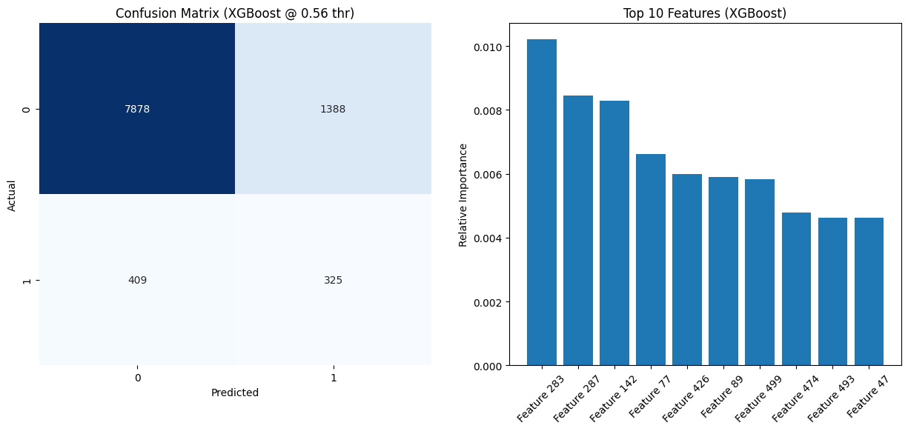

# Decision Trees on Membership Data

DATA: [KDD Cup 2009: Customer Relationship Prediction](https://kdd.org/kdd-cup/view/kdd-cup-2009/Data)

This exploratory project investigates the efficiency of decision-tree-based methods for real-world churn prediction. Using customer data from the French telecom company Orange (KDD Cup 2009), we compare the performance of a custom Decision Tree, Random Forest, and XGBoost. The analysis addresses key challenges such as class imbalance and mixed data types to effectively identify churning customers. 

The paper for the winners of this contest is here: [Winning the KDD Cup Orange Challenge with Ensemble Selection](https://proceedings.mlr.press/v7/niculescu09/niculescu09.pdf), their team used Ensemble Selection with 500-1000 individual models (including decision trees) to evaluate churn and achieved an impressive 0.7611 AUC Score in classifying churners. 

In my project, because test labels are not provided for the KDD CUP test set, I combined all 5 chunks and performed a **random stratified split (80% train / 20% test)** to create an unseen test set for model comparison.

### **Model Results**

| Model | **AUC** | **PR-AUC** | Accuracy | Precision | Recall | F1 | LogLoss (Raw) | LogLoss (Adj) | Threshold |
| :--- | :--- | :--- | :--- | :--- | :--- | :--- | :--- | :--- | :--- |
| **XGBoost** | 0.726 | 0.197 | 0.820 | 0.190 | 0.443 | 0.266 | 0.491 | 0.491 | 0.564 |
| **Random Forest** | 0.694 | 0.160 | 0.831 | 0.174 | 0.347 | 0.232 | 0.471 | 0.471 | 0.506 |
| **Custom Tree** | 0.609 | 0.107 | 0.722 | 0.112 | 0.401 | 0.175 | 0.946 | 0.594 | 0.564 |

As expected, **XGBoost** achieved the top performance with an **AUC of 0.726**. This score indicates that in roughly 73% of cases, the model correctly assigns a higher risk score to a churner than to a non-churner. The **Random Forest** classifier followed at 0.694, while the **Custom Tree** classifier reached 0.609. All models demonstrated a clear signal above the random baseline (AUC = 0.5). 

Two additional key metrics are precision and recall, combined into F1, which describe how often predicted churners are truly churners (**precision**) and how many of the total true churners we successfully caught (**recall**). The **F1** value shows the harmonic mean measurement of these two values. 

Note on LogLoss: The **Custom Tree** shows a high "Raw" LogLoss (0.946) because it was trained on a balanced dataset (50/50), causing it to predict probabilities around 0.5. However, after applying **probability calibration** (adjusting for the real class priors), its "Adjusted" LogLoss drops to 0.594, showing that the tree actually learned meaningful probabilities.

Note on Accuracy: although accuracy for each model seem high, it is misleading because our data is highly imbalanced, our models would score high even if they just **predict non-churn for most cases** (0). 

Below, the XGBoost confusion matrix (Churners = 1, Non-Churners = 0) shows the counts of predicted vs. actual labels. Top features are included as visual information.

### Calibration and Model Improvement

The calibration curves and the log-loss values in the figure below are computed using the same probability outputs (prior-corrected for the Custom Tree; unchanged for XGBoost/Random Forest). The XGBoost curve lying below the diagonal suggests it tends to overestimate churn probabilities (overconfident predictions). Also, since churn prevalence is 7%, a “predict-the-base-rate” baseline log-loss is roughly 0.25, so log-loss values around 0.5 indicate substantial probability error even when ranking metrics (AUC/PR-AUC) are decent.

To improve our models, generally, I would test on different feature selection techniques (rather than just ANOVA which apparently does not work well on decision trees yet I am doing so for speed), change the percentage of features used, try different model hyperparameters, and/or even perhaps try a bit of oversampling for the XGBoost and RandomForest models. For the sake of time, I decided not to pursue this experiment further as the main goal of decision tree experimentation was achieved.

## Decision Trees (From Scratch)

> **Note**: GitHub mobile does **not** render LaTeX math formulas.  
> Please view this project on a **desktop browser**.

As part of this exploratory project, I implemented a **binary decision tree from scratch** (`decisiontree.py`) to understand what a single tree can learn on its own (before moving on to ensembles).

### How the Tree Learns

Training starts with every example in one big “room” (the **root node**). The tree repeatedly asks a yes/no question of the form:

**Is feature _j_ ≤ threshold _t_?**

Each question splits the node into **left** and **right** child nodes. A good split makes the labels in each child more **pure** (less mixed). This implementation measures impurity using **entropy**:

- **Entropy = 0** → the node is perfectly pure (all 0s or all 1s)
- **Entropy > 0** → the node is mixed and uncertain

The tree chooses the split that maximizes **information gain**, i.e., the **reduction in entropy** after splitting:

$$
IG = H(parent) - \left(w_L H(left) + w_R H(right)\right)
$$

where $w_L$ and $w_R$ are the proportions of samples sent to the left and right child nodes.

### Split Search Strategy

At each node, the tree searches for the best split by:

- **Feature subsampling (Random-Forest style):**  
  If no feature list is provided, it evaluates $\sqrt{n_{features}}$ randomly chosen features (at least 1).

- **Threshold selection:**
  - If a feature has **few unique values**, it tries thresholds directly from the sorted unique values.
  - If a feature has **many unique values (> 20)**, it uses a **percentile-based** set of candidate thresholds to reduce computation.

This keeps the split search efficient for our dataset.

### Growing the Tree Recursively

The tree grows recursively using `build_tree`, splitting nodes until a stopping condition is met. A node becomes a **leaf** when any of the following occurs:

- `depth >= max_depth`
- `n_samples < min_samples_split`
- `entropy(y_node) == 0` (pure node)
- **No useful split exists** (`best_feature == -1`)
- The split is **degenerate** (all samples go left or all go right)

### What a Leaf Predicts

Instead of storing a hard class label, each leaf stores:

- **`value = mean(y_node)`**, the estimated **probability of class 1** for samples that reach that leaf.

Predictions are produced as:

- `predict_proba(X)` → returns `[P(class 0), P(class 1)]`
- `predict(X)` → thresholds `P(class 1)` at **0.5** to output 0/1 labels

### Tree Introspection

A helper function `summarize_tree(tree)` walks the fitted tree and prints:

- max depth
- number of leaves
- leaf size statistics (mean/min/max)
- which features were used most often in splits

### Class Imbalance Challenge

When I first trained the model, I came across my first **Class Imbalance** problem. The data itself, although rich in features and size, is composed of approximately **93% non-churners (0)** and **7% churners (1)**.

In our dataset, we implemented a two-stage split: first 40k training / 10k testing, then an 80/20 split of the training set for training/validation totalling 32k training / 8k validation. To maintain the distribution of the original dataset we called **stratify** on the 'churn' labels so that it maintains the original class distribution of the dataset. 

The problem was that, while our model achieved an impressive 93% accuracy, the classification report showed:
- Class 0 (No Churn): 99% Recall (It found almost all of them)
- Class 1 (Churn): 0% Recall (It missed all of them)

This happened because in our dataset "Churn" is rare (only 7% of data). Our tree can achieve 93% accuracy by simply saying "Nobody Churns", which is what it did (initially).

### Oversampling Strategy
To solve this, I implemented a technique called **oversampling** which took the 92% non-churn rows of the 32k training set, and matched them with an equal amount of duplicates from the churning labels. This technique led to a total training sample of 59.3k samples which matched a **50/50 churners v non-churners** sample.

After fine-tuning, a max_depth=10 and min_samples_split=8 were sufficient to reach an AUC of 0.609 (F1 = 0.175). 

### Advanced Optimizations
To further improve the custom tree, I implemented **feature subsampling** (similar to Random Forest), where the algorithm considers only a random subset of features (typically $\sqrt{n}$) at each split. Additionally, since the model was trained on oversampled data (50/50 distribution), I applied **probability calibration** to adjust the predicted probabilities back to the real imbalanced prior, ensuring the final risk scores are realistic. Note that while calibration improves probability quality metrics (like log-loss), ranking metrics (ROC-AUC, PR-AUC) remain unchanged.

Ultimately, a single decision tree proved insufficient for reliable classification on this complex dataset, leading me to implement a Random Forest Classifier.

## Advanced Tree Ensembles (Scikit-Learn & XGBoost)

### Random Forest Classifier

In a random forest classifier, we intrinsically follow the same tree idea implemented in DecisionTree.py, though now it is a collection of **many independent trees (1,000 in our case)** that collectively work together by making one final vote on classifying data.

In our RandomForest.py, we set `class_weight='balanced'`, which helps mitigate the imbalance by reweighting classes during training. Since this tool is available, we passed the original training data (using all 32k samples) rather than manual oversampling. We also monitor **PR-AUC (Average Precision)**, which is often a more informative metric than ROC-AUC for highly imbalanced datasets.

Our model achieved an AUC-ROC score of 0.694 and F1 of 0.232. It required a **threshold (0.506)** to optimize performance, suggesting the model needed a balanced confidence bar to identify the minority class effectively.

Still not satisfied with our results, I tried one final model stronger than RandomForest, which takes advantage of tree boosting.

### eXtreme Gradient Boosting Decision Trees (XGBoost) 

XGBoost is a **Gradient Boosting technique** (distinct from Random Forest's Bagging technique) where each decision tree is built sequentially, with each new tree focusing on correcting the errors (residuals) of the previous trees.

In XGBoostClassifier.py, we set `scale_pos_weight` to the negative-to-positive class ratio (≈ #non-churn / #churn) to counter class imbalance. We also utilized **early stopping** to automatically find the optimal number of boosting rounds and applied regularization parameters (`reg_lambda`, `subsample`, `colsample_bytree`) to prevent overfitting. Our model achieved good results at 0.726 AUC and F1 0.266, and at the chosen threshold it captures about 44% of churners (recall ≈ 0.443), with lots of room for improvement. 
